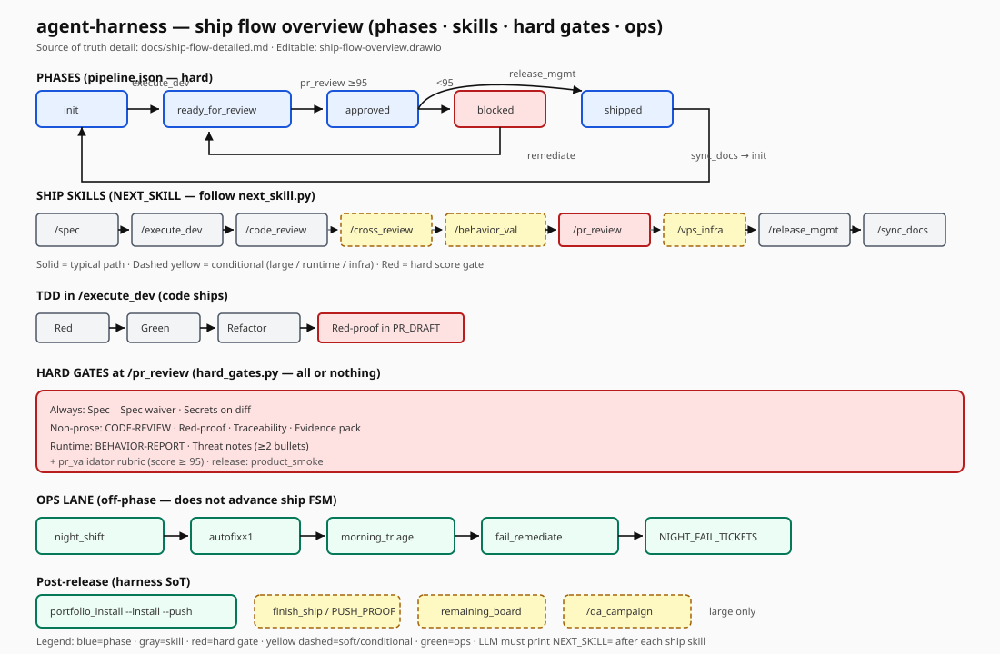
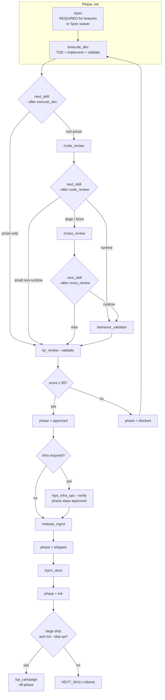
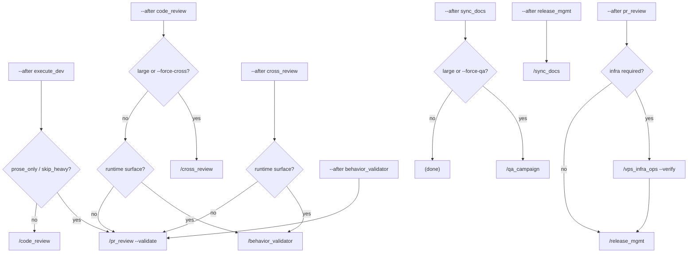
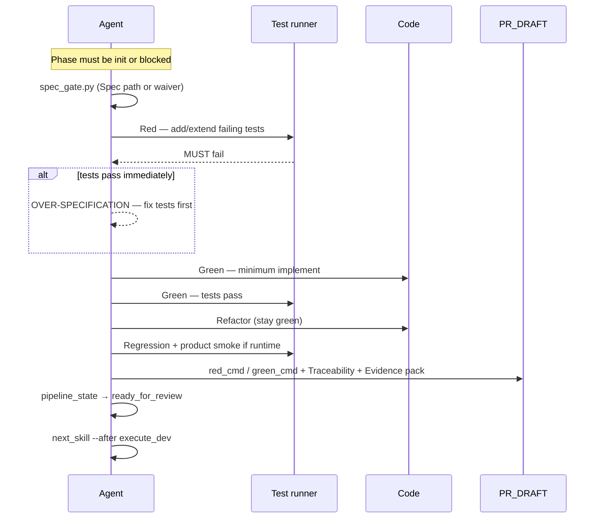
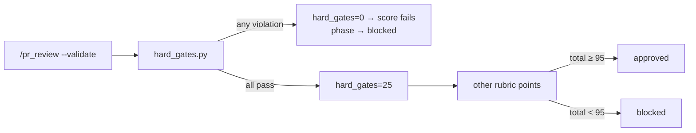
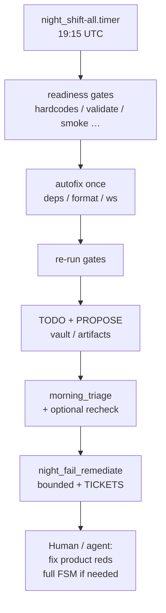

# Detailed ship flow (harness) — skills, gates, TDD, soft vs hard

**Audience:** operators **and any LLM** running portable skills under `.agents/skills/`.  
**Scope:** **agent-harness SoT only** (product domain skills like Catalyxt news are out of band).  
**Diagrams:** Mermaid (GitHub-native) + overview poster ([SVG](diagrams/ship-flow-overview.svg) · [Draw.io](diagrams/ship-flow-overview.drawio)).

| Read this if… | Start here |
|---------------|------------|
| First time / any LLM | [llm-bootstrap.md](llm-bootstrap.md) then **this page top-to-bottom** |
| Phase / transition rules only | [ship-flow.md](ship-flow.md) |
| Per-skill “when to fire” | [skills-catalog.md](skills-catalog.md) |
| TDD discipline | [tdd.md](tdd.md) |
| Overnight readiness | [night-shift.md](night-shift.md) |

**Non-negotiable for LLMs**

1. Do **not** invent the next skill — run `python3 scripts/next_skill.py --after <skill>`.  
2. Do **not** hand-edit `pipeline.json` — only `scripts/pipeline_state.py`.  
3. **Hard gates fail closed** at `/pr_review --validate` (`hard_gates=25` all-or-nothing).  
4. **Five phases only:** `init` · `ready_for_review` · `approved` · `blocked` · `shipped`.

### CODER modes (teaching overlay — not a new FSM)

Jules White–style work modes. Prefer **C → O → D → E**; open **R** only at decision points. Patterns: [prompt-patterns.md](prompt-patterns.md). Session pack: `python3 scripts/session_context.py --write`.

| Mode | Meaning | Harness examples |
|------|---------|------------------|
| **C** Compute | Deterministic tools / exit codes | hard_gates, pr_validator, product_smoke, next_skill, timers |
| **O** Organize | Structure memory | specs/tickets, pipeline.json, REMAINING, SESSION_CONTEXT, triage |
| **D** Display | Make state legible | NEXT_SKILL line, Mermaid/SVG, PUSH_PROOF, STATUS-style reports |
| **E** Engineer | Build & ship | execute_dev, TDD, release_mgmt, portfolio install |
| **R** Reason | Judgment under ambiguity | /spec clarify, cross_review personas, retrospect — **never** replaces hard gates |

---

## 0. Overview poster



- Editable source: [diagrams/ship-flow-overview.drawio](diagrams/ship-flow-overview.drawio) (open in [diagrams.net](https://app.diagrams.net/)).  
- Prefer **Mermaid sections below** for skill-level detail; poster is the mental model.

---

## 1. Phase FSM (hard states)

Phases live in `.agents/state/pipeline.json`. Only `pipeline_state.py` may change phase.

```mermaid
stateDiagram-v2
  [*] --> init
  init --> ready_for_review: /execute_dev\n(after implement + required reviews)
  ready_for_review --> approved: /pr_review --validate\nscore ≥ 95
  ready_for_review --> blocked: /pr_review --validate\nscore < 95
  blocked --> ready_for_review: /execute_dev\n(remediation only)
  approved --> shipped: /release_mgmt\n(+ smoke; infra if required)
  shipped --> init: /sync_docs
  note right of approved
    /vps_infra_ops --verify
    does NOT change phase
  end note
  note right of init
    /spec never changes phase
  end note
```



| From | To | Who may set | Hard gate (summary) |
|------|-----|-------------|---------------------|
| `init` | `ready_for_review` | `/execute_dev` | Task done; validate/smoke as needed; non-prose reviews done |
| `ready_for_review` | `approved` | `/pr_review --validate` | Score ≥ 95 (includes hard_gates) |
| `ready_for_review` | `blocked` | `/pr_review --validate` | Score &lt; 95 |
| `blocked` | `ready_for_review` | `/execute_dev` | Fix cited issues only |
| `approved` | `shipped` | `/release_mgmt` | product_smoke; tag/version |
| `shipped` | `init` | `/sync_docs` | Repo stamps |

**Illegal:** `/pr_review` from `init`; `/release_mgmt` before `approved`; inventing phases.

---

## 2. Happy-path skill sequence (on-phase)

Skills **inside** the FSM (order is enforced by `next_skill.py`, not by free choice).



---

## 3. NEXT_SKILL decision tree (after reviews)



**Command (mandatory handoff line):**

```bash
python3 scripts/next_skill.py --after <skill_just_finished> --base <task-base> --head HEAD
# prints exactly one: NEXT_SKILL=…
```

---

## 4. TDD inside `/execute_dev`

See also [tdd.md](tdd.md). Code ships are **fail-closed on process honesty** via hard gate **Red-proof**.



| Case | Required evidence |
|------|-------------------|
| Behavior/code change | Red must fail, then green; document `red_cmd` / `green_cmd` |
| Docs-only / prose | `TDD N/A (docs-only)` or waiver; no silent skip of code work |

---

## 5. Hard vs soft gates

### 5.1 Hard (fail closed — ship stops)

| Gate | When | Enforced by | Artifact / check |
|------|------|-------------|------------------|
| Spec or Spec waiver | Always at score | `hard_gates.py` | `**Spec:**` path or `**Spec waiver:** hotfix\|chore\|docs-only\|prose-only` |
| CODE-REVIEW marker | Non-prose code ships | hard_gates | `.agents/artifacts/CODE_REVIEW.md` contains `CODE-REVIEW` |
| Red-proof | Non-prose | hard_gates | red_cmd/green_cmd or TDD N/A language in PR_DRAFT |
| Traceability | Non-prose | hard_gates | `## Traceability` AC → test/smoke |
| Evidence pack | Non-prose | hard_gates | `## Evidence pack` with ≥2 of hard_gates/smoke/pytest/validate/coverage/SBOM |
| BEHAVIOR-REPORT | Runtime surface | hard_gates | `.agents/artifacts/BEHAVIOR_REPORT.md` |
| Threat notes | Runtime surface | hard_gates | `## Threat notes` ≥2 bullets |
| Secrets on diff | Score | hard_gates + check_secrets_diff | Clean or fail |
| PR score ≥ 95 | `/pr_review --validate` | `pr_validator.py` | Rubric includes hard_gates=25 all-or-nothing |
| Phase preconditions | Every skill | skill text + pipeline_state | e.g. release only if `approved` |
| product_smoke | `/release_mgmt` | `product_smoke.py` | plugin `smoke[]` exit 0 |
| Spec gate pre-code | `/execute_dev` code | `spec_gate.py` | Spec path exists or waiver |



### 5.2 Soft (skip, warn, or suggest — not score-kill by themselves)

| Mechanism | Behavior |
|-----------|----------|
| prose-only / skip_heavy_review | Skip code_review + cross_review + behavior path |
| cross_review | Only when large / forced; soft evidence warn unless `--strict-cross-review` |
| qa_campaign after sync_docs | Only large (or `--force-qa`); else `(done)` |
| vps_infra_ops | Only if product marks infra required |
| night_shift autofix | Mechanical once; residual → TODO |
| morning triage / remediate | Report + bounded fix; **no auto-ship of features** |
| portfolio_install | Default after **harness** release; products report lag |
| run_ship_chain | Deterministic closeout helper; not a substitute for LLM review quality |

### 5.3 Bounded automation (ops lane — not ship phases)



---

## 6. Skills map (portable harness)

### 6.1 On-phase / ship chain (must follow NEXT_SKILL)

| Skill | Mode | Phase effect | Hard inputs |
|-------|------|--------------|-------------|
| `/spec` | R/O | none | Spec file + roadmap OPEN |
| `/execute_dev` | E/C | → ready_for_review | init\|blocked; TDD; validate |
| `/code_review` | E/R | none | CODE-REVIEW artifact |
| `/cross_review` | R | none | CROSS-REVIEW (large) |
| `/behavior_validator` | C/E | none | BEHAVIOR-REPORT (runtime) |
| `/pr_review` | C | → approved \| blocked | score ≥ 95 |
| `/vps_infra_ops` | C/E | none | INFRA_RUNBOOK if required |
| `/release_mgmt` | E/C | → shipped | smoke; tag; portfolio install if harness SoT |
| `/sync_docs` | O/D | → init | stamps |
| `/qa_campaign` | E/C | none | after full cycle when suggested |

### 6.2 Off-phase / support (do not invent as “next ship step”)

| Skill | Mode | Role |
|-------|------|------|
| `/night_shift` | C/O | Overnight readiness |
| `/retrospect` | O/R | Learning notes |
| `session notes or /retrospect` | O | Session notes (harness meta) |
| `/handoff` / `/session_viewer` / `/agent_transcript` | D/O | Continuity / audit |
| `/sweep` / `/audit_harness` / `/night_shift` | E/C | Support, not phase drivers |

Install manifest: `config/ship_skills.txt`.

---

## 7. Scripts LLMs must know

| Script | Role | Hard / soft |
|--------|------|-------------|
| `pipeline_state.py` | FSM get/set | Hard (only mutator) |
| `next_skill.py` | NEXT_SKILL= line | Hard routing contract |
| `spec_gate.py` | Spec before code execute | Hard for code |
| `hard_gates.py` | Evidence pack at score | Hard |
| `pr_validator.py` | Score + phase | Hard |
| `review_scope.py` | prose_only / large / baseline | Soft routing input |
| `product_smoke.py` | Plugin smoke | Hard on release |
| `validate.py` / compliance | Daytime quality | Soft/hard by product |
| `finish_ship.py` | Push proof checklist | Soft helper / hard with `--require-push` |
| `run_ship_chain.py` | Deterministic unattended closeout | Soft helper (no LLM reviews) |
| `night_shift_morning_triage.py` | Morning FAIL table | Ops |
| `night_fail_remediate.py` | Bounded autofix + tickets | Ops |
| `portfolio_install_report.py` | Product harness lag; `--install --push` | Default after harness tag |
| `remaining_board.py` | REMAINING.md | Soft memory |

---

## 8. Artifacts checklist (score-time)

| Artifact | Owner skill | Hard when |
|----------|-------------|-----------|
| `PR_DRAFT.md` | implementer | Always useful; Spec/waiver always hard |
| `.agents/artifacts/CODE_REVIEW.md` | code_review | Non-prose |
| `.agents/artifacts/CROSS_REVIEW.md` | cross_review | Large (soft unless strict) |
| `.agents/artifacts/BEHAVIOR_REPORT.md` | behavior_validator | Runtime |
| `RELEASE_RUNBOOK.md` | release_mgmt | Ship |
| `.agents/artifacts/PUSH_PROOF.md` | finish_ship | Closeout |
| `.agents/artifacts/REMAINING.md` | remaining_board | Operator memory |
| `.agents/artifacts/MORNING_TRIAGE.md` | morning triage | Ops |
| `.agents/artifacts/NIGHT_FAIL_TICKETS.md` | night_fail_remediate | Ops |

---

## 9. LLM operating loop (copy-paste)

```text
0. python3 scripts/session_context.py --write   # Organize pack
1. python3 scripts/pipeline_state.py get
2. If feature work and no Spec/waiver → /spec first
3. /execute_dev  (TDD if code; spec_gate)
4. python3 scripts/next_skill.py --after execute_dev --base <base> --head HEAD
5. Run exactly NEXT_SKILL=…  (repeat after each skill)
6. /pr_review --validate  when next says so  → approved | blocked
7. If blocked → /execute_dev remediation only → back to reviews
8. /release_mgmt when approved (+ infra if required)
9. /sync_docs → init
10. finish_ship / push; if this is agent-harness SoT → portfolio_install --install --push
```

**Deterministic shortcut (no LLM review depth):**

```bash
python3 scripts/run_ship_chain.py --root . --base <task-base> --head HEAD --push
```

Use for chore/closeout automation; **do not** use as an excuse to skip real review on product features.

---

## 10. Related docs

| Doc | Purpose |
|-----|---------|
| [ship-flow.md](ship-flow.md) | Canonical short FSM + ASCII map |
| [skills-catalog.md](skills-catalog.md) | Skill index |
| [llm-bootstrap.md](llm-bootstrap.md) | Any-LLM entry |
| [tdd.md](tdd.md) | Red→green |
| [night-shift.md](night-shift.md) | Overnight + morning |
| [start-a-feature.md](start-a-feature.md) | /spec front door |
| [prompt-patterns.md](prompt-patterns.md) | White-style patterns → skills (P3) |
| [security.md](security.md) | Secrets / threat posture |

---

## 11. Diagram maintenance

| Asset | Role | Edit with |
|-------|------|-----------|
| This file (Mermaid) | Detailed SoT for skills/gates | Text PR |
| [diagrams/ship-flow-overview.drawio](diagrams/ship-flow-overview.drawio) | Poster SoT | diagrams.net |
| [diagrams/ship-flow-overview.svg](diagrams/ship-flow-overview.svg) | GitHub/static render | Export from Draw.io after edit |

When changing phases or hard gates: update **this page + ship-flow.md + hard_gates.py behavior** in the same PR.
